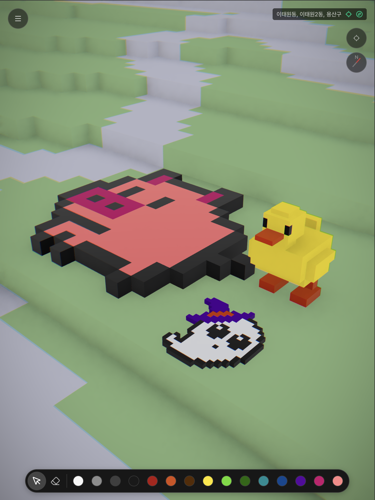
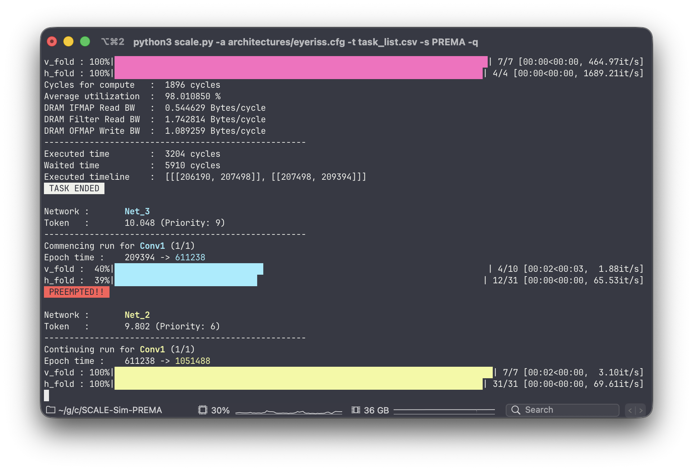
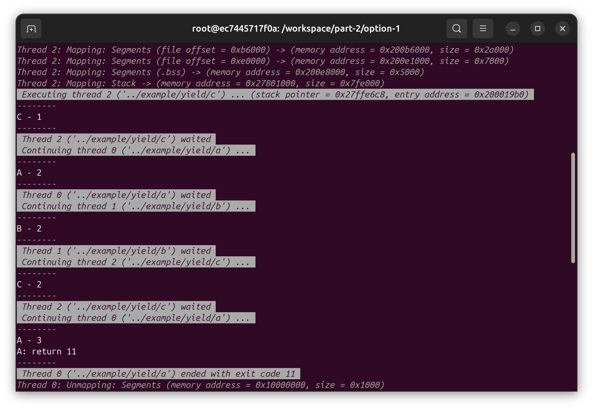
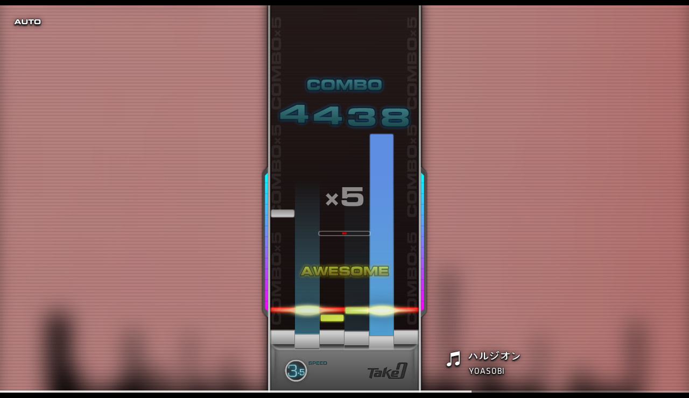

I care about systems and how we represent them — the layers, abstractions, and interfaces that shape what computers can do.

## Interests

- Computer systems and architecture
- Memory, locality, and accelerators
- Representation and abstraction design
- System interfaces and boundaries
- Spatial computing
- Visual and interaction design, especially in earlier projects

## Selected projects

### [pixelet](https://github.com/canplane/pixelet) · 2025–2026

**[▶ Play](https://plei.me)**

A location-based spatial world built over real-world geodata ([OpenStreetMap](https://www.openstreetmap.org/) + [Copernicus GLO-30](https://dataspace.copernicus.eu/explore-data/data-collections/copernicus-contributing-missions/collections-description/COP-DEM) elevation).

The work includes custom spatial coordinates and hierarchy, compact typed-array
transport, terrain representation and streaming, a sparse-octree object layer for
placed voxels, voxel rendering, and LOD.

This is also where I'm leaning on AI-assisted implementation the most, while
still designing the core system architecture and representations myself.

### [SCALE-Sim-PREMA](https://github.com/canplane/SCALE-Sim-PREMA) · 2021

An undergraduate research project extending [SCALE-Sim](https://github.com/ARM-software/SCALE-Sim)
with [PREMA](https://doi.org/10.1109/HPCA47549.2020.00027) (HPCA 2020), a preemption-aware
multi-task scheduling algorithm for neural accelerators.

The implementation adds task scheduling, runtime prediction, checkpoint/resume,
and mid-layer preemption to the simulator.

### CALAB-loader (private) · 2021

A from-scratch, user-level ELF64 loader, demand pager, and cooperative thread
runtime for x86-64 Linux.

Written as a programming test for admission to a [KAIST](https://www.kaist.ac.kr/en/) research lab, with
no starter implementation. It builds process startup state manually, implements
SIGSEGV-driven demand paging and cooperative user-level scheduling, and transfers
control directly into loaded binaries.

### [Take-0](https://github.com/canplane/Take-0) · 2015, 2022

**[▶ Gameplay video](https://youtu.be/cUBBpqlfMAc)**

A keyboard rhythm game inspired by [DJMAX](https://en.wikipedia.org/wiki/DJMax), originally written in Flash and later
revived and ported from ActionScript 2 to ActionScript 3.

Along with the game itself, it includes a note editor and configuration tooling.

### [PIVOT](https://github.com/canplane/PIVOT) · 2010–2014

**[▶ Play](https://pivot-14.netlify.app)**

My first long-running software project, started in middle school.

A widget-based desktop launcher built with Flash/ActionScript 2 — widgets snap to
a grid across multiple pages, each with its own settings, inside a shared launcher UI.

It began as a quicker way to search the web and gradually grew into a small
personal software environment.

